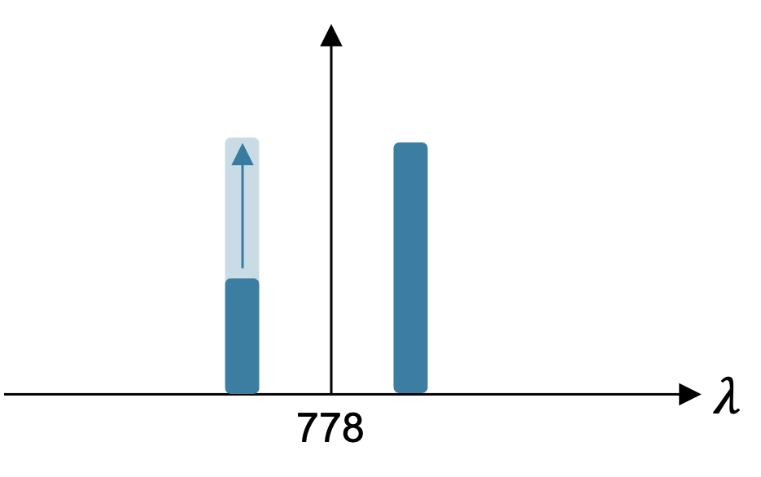

# RbONN

## Code status

Which files are being developed, and which are kept only so something else keeps
running. Nothing marked **legacy** or **dead** should be imported from new code.

### Live

| Path | Role |
|------|------|
| `src/calibration_module/fit/` | calibration physics — models, fits, file formats. Imports no driver, so it can be run against saved CSVs with the bench powered down. |
| `src/calibration_module/measure/` | acquisition — drives the SLM, DAQ and OSA and returns rows. Does no fitting. |
| `src/calibration_module/steps/calib_step6_v2.py` | **current** step 6 — the difference estimator (`D(w) = Y(1,w) − Ŷ(0,w) = η²w + a_x + q_x`), 31 acquisitions over 10 repeated levels. Self-contained: it fits in-module and does not import `fit/pair.py`. |
| `src/calibration_module/steps/calib_step{6,7,8}_v1.py` | the v1 chain — dispatch to SLM + DAQ, collect, fit, plot. Steps 7 and 8 still run on v1; step 6 v1 is kept for the joint-fit comparison and to re-fit historical CSVs. |
| `src/calibration_module/measure/bench.py` | SLM/DAQ connection helpers shared by the step scripts |
| `src/{daq,osa,scope,heater}_module/`, `src/slm_module/{controller,driver,encoding,generator}` | instrument drivers and pattern encoding |
| `src/gui/` | the PyQt5 control suite (entry point `src/main.py`). It drives every instrument, not just the SLM, which is why it sits beside them rather than inside `slm_module/`. |
| `src/drafts/monitor_lib.py` + `daq_osa_monitor.py` / `daq_pmt_monitor.py` | overnight drift monitors |

### Legacy — alive only because the GUI still calls them

The calibration chain is mid-rewrite, so these are frozen on the v1 model. They
duplicate what the `calib_step*_v1.py` drafts do — **two implementations of the
same measurement** — and the drafts are the ones being developed. Delete each
once its GUI page is rebuilt.

| Path | Kept alive by |
|------|---------------|
| `src/calibration_module/measure/pair.py` | Step 6 — [app.py:4855](src/gui/app.py#L4855) only |
| `src/calibration_module/measure/phase.py` | Step 7 — [app.py:5302](src/gui/app.py#L5302) only |
| `src/calibration_module/measure/center.py` | TPA centre scan — [app.py:5581](src/gui/app.py#L5581) only |
| `src/slm_module/calibration/calibration.py` | the old sin² transfer-curve fit. Step 3 is `calibration_new.py`; only `intensity_model` (used by `outliers.py`) and one GUI "load a calibration CSV" path at [app.py:7170](src/gui/app.py#L7170) still reach it. `phase_for_level` and `predict_intensity` are exported and called nowhere at all — not in `src/`, not in the tests. |

### Dead — nothing imports these

| Path | Why |
|------|-----|
| `src/slm_module/scope_tpa.py` (451 lines) | scope-era diagonal-only TPA sweep (`x = w = √u`), superseded by `calibration_module/fit/pair.py`. Zero importers. |
| `src/slm_module/scope_background.py` (465 lines) | its only consumer is `scope_tpa.py`. Zero other importers. |
| `src/bg_scatter.csv`, `src/bg_scatter.json` | `scope_background` output, committed to the `src/` root rather than `src/calib_data/` |
| `tests/test_bit_depth.py` | loads `tests/fixtures/bit_depth_golden.npz` at import. `.gitignore` excludes `*.npz`, so the fixture can never be committed and `tests/fixtures/` does not exist — the file errors on every run. |
| `src/slm_module/calibration/calibration_new.py` → `intensity_calibration` (~225 lines) | the OSA per-coordinate Step-3a sweep. Its only caller was the GUI's Step 3a page / Run All, both deleted; `tests/test_calibration_new.py` is all that reaches it now. The live Step 3 is `intensity_calibration_daq` (3c) and `batch_intensity_calibration` (3b). Same for `restrict_to_measured_intensity_range`. |

The whole scope readout path is dead: the measurement moved to the DAQ bucket
detector, and no `scope_*` module in `slm_module` has an importer left.

### Deliberately not maintained

`src/calib_data/refit_0904/{compare_runs,diagnose_45,refit_as_driven}.py` are
analysis scripts stored beside the run they analysed. Their imports still point
at the pre-split `calibration_module.phase` / `.sigma` and will not run as-is;
they are kept as a record of what was executed on 0904, not as working code. If
you need one, copy it out and repoint it at `calibration_module.fit.*`.

**Dangling references:** `src/drafts/heat_controller.py` has been deleted, but
four docstrings still name it as the thing they mirror —
`heater_module/__init__.py`, `heater_module/controller.py`,
`heater_module/driver.py` and [app.py:5931](src/gui/app.py#L5931).
The code is fine; only the pointers are stale. `heater_module/` is now the
sole copy of that logic.

### Hidden GUI pages — built, but not shown as tabs

Three pages are constructed by `_build_calibration_page` and never added to the
tab bar. They stay built because other pages read their widgets, or because
re-tabbing them should be a one-line change rather than a rebuild.

| Page | Why it is hidden | What still needs it |
|------|------------------|---------------------|
| **Step 4b · Stage3 Reopt** | its result is wired to nothing. The shape actually in use is the frozen `OPTIMIZED_ENCODING_SHAPE` constant in [optimization.py:123](src/slm_module/optimization.py#L123), hand-transcribed from `encoding/2026-07-03_run162902/best_so_far.json`. A 4b run writes a new `best_so_far.json` under its own output root and nothing reads it. | `_set_calibration_running` gates `stage3_reopt_stop_button`; `calibration_run_buttons` holds `stage3_reopt_run_button` |
| **Step 6b · TPA Center** | its Apply button does not apply. The encoding layout is read verbatim from the Step 3c calibration, so a valid centre fit only prints *"re-run Step 3c with this target centre"* — it looks like it re-centres the channels and does not. | nothing; self-contained |
| **Mod Error** | never had a tab | the Encoding Gain (TPA Encoding page) and Quick Test sweeps read its `ana_*` OSA sweep-settings widgets |

To bring 4b or 6b back, swap the `self._..._page = self._build_...()` line for an
`addTab` call at [app.py:842](src/gui/app.py#L842). Neither is deleted, and the
underlying calibration code (`optimization.py`, `calibration_module/fit/center.py`)
is live and tested — it is the GUI wiring that is incomplete.

### Superseded drafts

Kept for provenance; they answered their question and are not maintained.

| Path | Status |
|------|--------|
| `src/calibration_module/steps/calib_step3_todaq_test.py` | one-off DAQ smoke test; Step 3 on the DAQ is now `calibration_new.intensity_calibration_daq`. Its docstring still gives the pre-move path `tests/slm_sin2_level_sweep_test.py`. |
| `src/drafts/hold_pid.py`, `src/drafts/pid_sweep.py` | PID tuning is finished (25 °C → 0.5/20/5, 79.5 °C → 0.5/20/2, with a DC base heater). The staircase controller now lives in `heater_module/`. |
| `src/drafts/daq_hold_time_test.py`, `src/drafts/daq_repeat_measure.py` | one-shot characterisations of settle time and repeatability |

### Stale docs

| Path | Problem |
|------|---------|
| `docs/calib_0715_steps_6_7_8.md` | names `calib_step{6,7,8}_test.py` (now `_v1.py`) and `slm_module.tpa_{pair,phase}` (now `calibration_module.{pair,phase}`). Every uncertainty in it is an SEM with Birge-scaled errors and χ²/dof — all three were removed in favour of the trace std, so the numbers are not reproducible from today's code. |

## Alignment

Set the polarization chain before calibrating, so the SLM modulates at full
contrast. Work through the steps in order; they iterate.

1. **TM into the grating.** The PBS reflection port outputs TE, so the first
   HWP must rotate it to TM. Put a power meter at the grating output and rotate
   the first HWP until the diffracted power is at its **minimum** — the grating
   is least efficient for TM light, so minimum diffracted power means the beam
   is fully TM.
2. **TE out of the SLM.** Set the SLM to its bright level and put the power
   meter at the PBS output. Rotate the second HWP for **maximum** transmission,
   then fine-tune the SLM bright level and rotate again, iterating until the
   transmission peaks.
3. **Maximize extinction.** With the power meter still at the PBS output, set
   the SLM to its dark level and fine-tune the dark level for **minimum**
   transmitted power. If the extinction ratio (bright / dark) is below
   **25 dB**, repeat from step 1.

## Calibration

### Step 2 — wavelength map (px → nm)

Maps each SLM column to the wavelength it controls. An all-dark and an
all-bright frame are measured once as background / reference; then a
`window_size`-wide bright window walks across the scan region, and each
position's normalized spectrum is reduced to one `(coordinate, wavelength)`
point by a weighted centroid around its peak (`peak ± window` nm). A polynomial
fit (degree ≤ 3) over the points gives the map; the saved result always carries
the **dense per-column grid** plus `wavelength_fit_coefficients`, regardless of
how few positions were actually measured.

Acquisition knobs (GUI: Step 2 tab / pipeline wl_map stage):

| Knob | Effect |
|------|--------|
| `coordinate_stride` | measure every Nth column; the near-linear fit fills the skipped ones |
| `sweep_span_nm` | fast mode: measure the two region-edge positions with the wide OSA span first (**anchors**), draw a line through them, then re-center this narrow span (~1 nm) on the predicted wavelength at every other position — ~8× fewer samples per sweep with AUTO sampling |
| `min_peak_wavelength_nm` | ignore peak-search samples below this wavelength; masks artifacts below the source band (GUI default 775) |
| `max_peak_wavelength_nm` | ignore peak-search samples above this wavelength; masks a fixed leakage artifact the SLM never modulates (light landing outside the active area, ~781.7 nm on this setup → set ≈781.5) |
| `outlier_policy` | post-sweep auto-remeasure of points that sit off the linear map |

Normalized traces are only trusted where the bright reference carries at least
5% of its peak power — outside the source spectrum the reference − background
denominator is ≈0 and would inflate drift residue into spurious peaks (the
historical cause of stride points landing off the line).

### Step 3 — grayscale transfer curve per coordinate

For every coordinate mapped in Step 2, the panel lights one `window_size`-wide
window at that coordinate (rest of the panel at `min_level`) and sweeps the
window's grayscale level across `level_range`. The measured output at each level
is that channel's **transfer curve** — how commanded grayscale maps to optical
power at its wavelength.

| Field | Meaning |
|-------|---------|
| `level_range` | SLM grayscale levels swept (ascending) |
| `intensity_levels` | normalized output power, shape `(n_coordinates, n_levels)` |
| `raw_intensity_levels` | background-subtracted output (watts / volts) |
| `min_level` / `max_level` | off / on grayscale levels carried from Step 1 |

Two acquisition backends produce the same `CalibrationResult`:

- **OSA** (`intensity_calibration`) — reduces the spectrum around each
  coordinate's calibrated wavelength, and refines the wl→px map from this
  narrower sweep. **No longer reachable**: this was the Step-3a page, deleted
  along with Run All. The function survives for reference and is exercised only
  by `tests/test_calibration_new.py`.
- **DAQ bucket detector** (`intensity_calibration_daq`) — no spectral
  resolution, so intensity is a plain dark-frame subtraction: an all-`min_level`
  frame is read once as the DC background and subtracted from every window
  reading (clamped at 0). No all-bright reference is taken — the downstream
  $I_0\,\sin^2(\theta/2)$ model fits $I_0$ as a free amplitude, so absolute scale
  is irrelevant, and a full-bright panel could saturate the photodiode. This
  is what Step 3c runs.

The old **Channels only** toggle on the Step-3a page — scan only where an
encoding channel lands, rather than walking every calibrated coordinate — is now
the whole of Step 3c, which takes its scan coordinates from 3b's channel
structuring instead of from a window/pad guess. Each row of the result is a channel,
so the sweep is roughly `n_coordinates / n_channels` times shorter (≈20× on a
typical map) while producing a `CalibrationResult` the encoder reads unchanged.

**Step 3c — channel grid + DAQ**: the same DAQ sweep, but the scan coordinates
come from Step 3b's channel structuring: mirror-symmetric channel pairs are
tiled around a configurable **target center** wavelength (default 778 nm), and
any channel whose window overlaps a **guard band** (default 780 / 776 ± 0.06 nm)
is skipped, with the next pitch outward tried instead. Guard bands must be
symmetric about the target so the x/w pairs keep equal wavelength offsets.

At encode time the transfer curve is **inverted**: `EncodingChannel.level_for(val)`
maps a target normalized value $val \in [0, 1]$ to a grayscale level. Two methods,
picked by `method=`; the returned level is rounded to the nearest integer
grayscale either way, so even a coarse sweep can command levels between the
swept points.

- **`"fit"`** — the default from `channel_layout_from_calibration`, i.e. what the
  calibration chain and the GUI actually use. Inverts the fitted model in
  [`calibration/transfer.py`](src/slm_module/calibration/transfer.py):

  $$I(L) = \mathrm{floor} + \mathrm{contrast}\cdot\sin^2\!\big(\Delta(L)/2\big),
  \qquad \Delta(L) = c_2 L^2 + c_1 L + c_0$$

  `level_for` solves $\sin^2(\Delta/2) = val$ for $\Delta = 2\arcsin\sqrt{val}$ —
  exactly the retardance `calibration_module.fit.phase.phi_half` assumes downstream —
  then inverts $\Delta(L)$ on its rising branch. Full scale is the model's
  $\Delta = \pi$, not the swept `argmax`, so one noisy sample cannot redefine it.
- **`"interp"`** — linear interpolation between the two swept points bracketing
  the target, over the off→on rising segment (made monotonic with a cumulative-max
  envelope so noise near the flat top can't invert the mapping). Kept for
  comparison; `val = 0` → swept `argmin`, `val = 1` → swept `argmax`.

The quadratic term $c_2$ (`phase_curv`) is the panel's own level→phase
nonlinearity, added after the 0907 Step-3c sweep resolved it: the linear model's
residual there is a coherent sinusoid, in phase on all 12 channels, and one
quadratic term cuts rms from 1.25 % of contrast to 0.23 %. Physically the phase
response is sublinear — about 7.5 mrad/level near extinction falling to 5.6 near
full scale — and encoding that with a linear $\Delta$ over-delivers by up to
+2.4 % of full scale around $val \approx 0.65$. The noisier 0903 OSA sweeps could
not resolve it, so `phase_curv` is fitted only when it moves a `level_for` result
by at least half a grayscale; otherwise it stays exactly `0.0` and the model
reduces to the original 4-parameter linear one. Fits stored before the term
existed load as `phase_curv = 0.0` and are unchanged.

Only $\Delta(L)$ is curved. The $val \leftrightarrow \Delta$ relation is a
definition, not a measurement, so `phi_half` and the step 6/7/8 phase model are
untouched — the curvature changes only which grayscale is written to reach a
given $val$. `src/drafts/plot_step3_transfer.py` fits any Step-3 CSV both ways
and reports the difference.

**Bad cells are dropped, not just down-weighted.** `fit_transfer_curve` fits,
measures the residual scale with a MAD, drops anything past `clip` robust sigma
(default 6) and refits until nothing more is found; `n_clipped` on the stored fit
records how many went. The soft-L1 loss alone was not enough. On 0907 Step-3c,
four latched DAQ cells on channel 11 left a stored fit with an rms of 824 % of
contrast and an encoding window of 417..573 against 399..887 on its neighbours —
and since `save_calibration_result` fits once at write time, that is what every
step 6/7/8 run reading the file would have encoded that channel with. Dropping
them gives rms 0.18 % and a window in family. The threshold is judged against the
final model, curvature included, with the sigma floored at 0.1 % of contrast;
both details are load-bearing and the reasons are in the constants.

The limit is worth knowing: this finds outliers the fit *disagrees* with. Points
numerous or coherent enough to capture the fit have small residuals and no
threshold reaches them — that case shows up as an absurd `contrast` or encoding
window instead (`TransferFit.extrapolated` / `.clipped`). **Calibration JSONs
written before this existed keep their unclipped fits**; run
`src/drafts/plot_step3_transfer.py` on the matching CSV and compare its table
against the file's `transfer_fits` to see whether one needs regenerating.

### Step 6 — TPA efficiency ($\eta$) per pair

For a channel pair with per-side commanded intensities $x, w \in [0, 1]$, the 420 intensity $Y$ can be written as:

$$Y = \eta^2 (x \cdot w) + a_x\, x + q_x\, x^2 + a_w\, w + q_w\, w^2 + d$$

| Param | Physical meaning |
|-------|------------------|
| $\eta$ | two-photon efficiency of the pair (fit is linear in $b = \eta^2$; $\eta = \sqrt{b}$) |
| $a_x,\ a_w$ | single-beam linear response of each sideband |
| $q_x,\ q_w$ | single-beam quadratic (saturation) response of each sideband |
| $d$ | dark offset (readout with both sides off) |

Single beam — one sideband on, amplitude swept (pins $a$, $q$):

Cross (pair) — one sideband pinned at $x = 1$, the other swept; the only points with $x \cdot w \neq 0$, so they pin $\eta$:

#### Extracting $\eta$ — the difference estimator (v2)

The model above is unchanged. What changed is how $\eta$ is pulled out of it.

v1 fit all six parameters jointly over three sweep lines. Because $d$ is shared
across those lines, misfit on the x-only line leaks into $d$ and from there into
the cross line's intercept/slope split — dropping $q_x$ moved $\eta$ by
**+0.67 %** on pair 0 (August data), while leaving pairs 1 and 3 unmoved at
0.01 %. That sensitivity is the estimator's, not the physics'.

v2 subtracts the w-only background along the cross line instead:

$$D(w) \equiv Y(1,w) - Y(0,w) = \eta^{2}\,w + (a_x + q_x)$$

| term | fate |
|------|------|
| $a_w,\ q_w,\ d$ | **cancel identically** — no role in $\eta$ |
| $a_x,\ q_x$ | survive only as their sum, the intercept $\beta_0$ |
| $\eta^{2}$ | the slope |

$\eta$ is then the slope of a two-parameter straight line. Nothing needs to be
assumed about the shape of the single-beam background, and the $q$-term question
disappears. The background block is still fitted — steps 7 and 8 need
$a_x, q_x, a_w, q_w, d$ for the forward model — but it no longer touches $\eta$.

**$\hat B$ is fitted, so the $D$ points are correlated.** The grid has no
w-only level at any cross $w$, so the difference cannot be formed point-by-point;
it is taken against the fitted curve $\hat B(w) = a_w w + q_w w^2 + d$, which
means every $D$ shares those parameters. The background covariance is propagated
into a full covariance for $D$ and the slope comes from a **generalized** least
squares fit. Treating the points as independent would re-introduce exactly the
slope/intercept leak the estimator exists to remove.

**Grid — 31 acquisitions per pair** (37 with the verification block), every
level repeated with an SLM rewrite in
between, so the repeat scatter measures encoding repeatability rather than
detector jitter alone:

| block | $(x,w)$ | $n$ | pins |
|-------|---------|-----|------|
| dark | $(0,0)$ | 2 | $d$ |
| x-only | $(0.5,0)$, $(1,0)$ | 2, 3 | $a_x, q_x$; $(1,0)$ also anchors $D(0)$ |
| w-only | $(0,0.5)$, $(0,1)$ | 2, 2 | $a_w, q_w$ |
| **cross** | $(1,w)$, $w \in \{0.2, 0.45, 0.7, 0.9\}$ | 4, 4, 4, 6 | $\boldsymbol{\eta^{2}}$ |
| diagnostic | $(1,1)$ | 2 | top-drive compression — **excluded from the slope fit** |
| *verification* | $(1,0.25)$, $(0.5,0.5)$ | 3, 3 | product-only check (below) — **excluded**, +6 acquisitions |

Repeats are interleaved as round-robin passes rather than run back-to-back, so a
slow drift shows up as scatter within a level instead of masquerading as a slope.

$\eta$ is a **local** slope over $w \in [0.2, 0.9]$ and is reported with that
range, because the cross line is not exactly straight. How not-straight is the
point of the excluded level: on the August data the top-drive point sits
**−12.4 %** below the extrapolated line — v1 included it and took a −3.44 mV
residual there.

##### Verification

Four checks print with every fit. **None feeds the fit** — they say whether the
model $\eta$ is defined within still holds on this pair. Two come free from the
grid (the $D(0)$ anchor, and the top-drive point above); two are explicit:

**1 — intercept identity.** $D(w) = \eta^2 w + (a_x + q_x)$ means the cross line
extrapolated to $w = 0$ must land on $a_x + q_x$, measured independently in the
x-only block. Curvature over the fit window shows here first, because
extrapolating to zero amplifies it. On the v2 grid the background block is
saturated, so $a_x + q_x$ equals the raw $Y(1,0) - Y(0,0)$ exactly and this
restates the anchor through the fitted parameters; re-fitting a v1 CSV gives an
over-determined background and the two then genuinely differ. On the August
data it passes at pull −0.03.

**2 — product-only dependence.** The model says $Y$ depends on the two drives
only through $x\,w$. $(1, 0.25)$ and $(0.5, 0.5)$ share that product but split
the drive very differently, so after subtracting the full single-beam
background their TPA residues must agree. Neither point exists in the base
grid, so this costs **6 extra acquisitions** (31 → 37, ≈ +1 min/pair) in a
verification block that stays out of the slope fit.

It is worth them, because a split here does not mean the estimator is wrong —
it means the pair has **no single $\eta$ at all**, which would invalidate the
one-number-per-pair model steps 7 and 8 are built on. And the slope fit will
not reliably catch that on its own: with a 10 % drive-split tilt injected into
synthetic data, $R^2$ was still 0.9995 and $\eta$ moved only 0.26 %, because the
tilt is nearly linear in $w$ along $x = 1$ and gets absorbed into the slope and
intercept. The residual pulls did rise (max 7.2), but only the product check
names the cause — +6.8 % split at 9.1 σ.

Set `VERIFY_ENABLED = False` for the bare 31-acquisition grid; the product check
then reports itself as not measured rather than silently passing.

## Encoding

### Channel layout

The channel geometry is decided **once**, when the Step-3b/3c measurement grid
is designed (`build_channel_calibration_grid`), tiling the panel into
symmetric channel **pairs** around the 778 nm centre:

1. Fit `wl = a·x + b` over the Step-2 map (`a < 0`: higher pixel → lower λ).
2. Anchor the centre pixel `c0 = round((778 − b) / a)`. It sits in the middle of
   a `gap_px` pad, so no channel covers it.
3. Convert the Rb guard bands (default 779.9–780.1 and 775.9–776.1 nm) to
   inclusive pixel ranges that must stay dark.
4. Tile a shared offset `m` outward from `c0` (half-pitch start,
   `pitch = width + gap`), placing a mirror pair each step: an **x**-channel at
   `c0 − m` (λ > 778) and a **w**-channel at `c0 + m` (λ < 778). One shared `m`
   keeps each pair exactly symmetric about the centre column — and, under the
   linear fit, symmetric in wavelength about 778 nm.
5. If either window would cover a guard band, `m` jumps past it (both sides move
   together, staying symmetric), so channels land on both sides of the Rb line.
   Tiling stops when either side leaves the calibrated range, so the two sides
   are always equal length (the encoder's x/w pairing contract).

Defaults: `channel_width_px = 15`, `gap_px = 5`, `n_channels = 20` per side.
Padding, guard-band, and centre columns render at their local off level, so
they stay dark with no extra masking.

Every consumer of a Step-3b/3c result — the TPA Encoding tab and the draft
step scripts — loads it **verbatim**
(`channel_layout_from_calibration`): the calibration already *is* the channel
structure (one row per channel centre, with the target centre, pitch and guard
skips baked into the coordinates), so centre, pitch, x/w pairing and guard
gaps are all derived from the mirror-symmetric grid. No re-tiling and no
nearest-coordinate snapping — the encoder always drives exactly the channels
that were measured, and pair indices mean the same thing everywhere. The one
number the file does not record is the window/gap split; the window width is
taken as `pitch − gap_px` (default gap 5 px). To move the channels, re-run
Step 3c with a new target centre.

The legacy re-tiling consumer (`build_channel_layout`) is deprecated for
Step-3 results; it remains only where no measured channel grid exists yet —
the coarse Step-1+2 quick-test preview and the TPA centre scan, which must
move the layout centre to sweep it.
